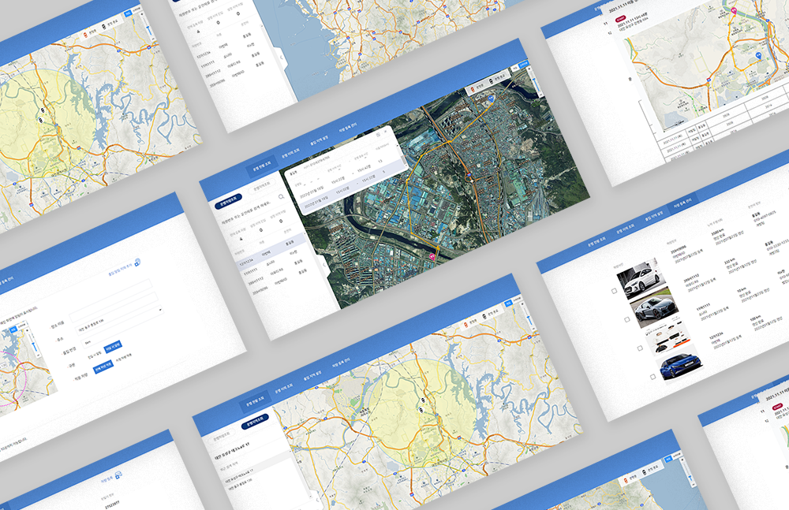

## 신입개발자 이력서 작성 Tip 📝
    이력서는 인터뷰(혹은 과제) 기회를 얻기 위한 문서이다. 채용 담당자가 내 이력서를 읽었을 때 호기심이 생겨서 나를 한번 만나보고 싶은 마음에 들게끔 작성해야 한다. 
    
### 자기소개
    
- 자기소개에 정답은 없다.
- 우리는 경험이 없기 때문에 내가 어떤 개발자인지 소개하면 정말 좋다.
- 자기소개는 2~5줄로 요약해서 작성한다.

1. 작성 예
```html
성장을 위한 개발 문화를 고민하는 신입개발자 홍길동 입니다.

비전공자로 잘할 수 있을까라는 생각이 많이 들었습니다. 내가 만든 프로그램이 동작하는 걸 보고 재미를 느꼈고 팀 프로젝트를 진행하며 개발자의 길을 선택했습니다. 

큰 임팩트는 혼자가 아닌 함께 만들 수 있다고 생각하기에 구성원들과 적극적으로 커뮤니케이션하며 학원 수업을 들었습니다.

Clean Code와 Test에 대한 고민을 생활화합니다. 

거미줄이 촘촘할수록 더 좋은 먹이가 걸리는 것처럼 학원 수업 외 사이드 프로젝트를 하며 지식을 공유합니다.
```
2. 매우 잘못된 예 😈 (엄근진)
```html
장남으로 태어나 어렸을 때 부터 엄격한 가정환경에서 살았고... 대학교는 어디를 나와..학원수업은..
```

### 스킬

- 많을수록 능사가 아니다. 
- 지원한 포지션과 관련 없는 기술, 내가 익숙하지 않거나 제대로 써본 적 없는 기술을 제외한다.

### 프로젝트

- 이력서에서 가장 중요한 부분.(나는 `이걸` 했고, 이런 `스킬`을 가졌어!)
- 기간, 참여인원, 맡은 업무, 사용 스킬은 `필수입력란` 이다.
- 학원에서 진행한 프로젝트를 `모두` 입력하자.
- 신입 때는 프로젝트 `보완점`과 `느낀점`을 꼭 쓰자.
- 만일 여러 명이 함께한 일이라면 구체적으로 자신의 `역할`과 `기여도`를 나타낸다.
***
* 작성 예시 👨‍🏫

  

- 주제 : 차량관제 프로젝트
- 개요 : 차량관제 프로젝트는 차량을 수기로 관리하는 업체를 대상으로 만든 프로젝트 입니다.
- 프로젝트 기간 : 3주
- 프로젝트 인원 : 3명(프론트 1, 백엔드 1, 펌웨어 1)
- 사용 기술 : Spring Boot, JPA, MySQL, Thymeleaf, Git, AWS
- 담당 업무 : API 개발, DB 테이블 설계
- 세부 업무 : 카카오맵 API를 이용한 차량 위치 추적 페이지, 차량 운행정보 페이지 개발

- 느낀점 : 
    - git으로 프로젝트를 관리하며 개인프로젝트때 느끼지 못한 commit 충돌 이슈와 팀원간 소통 중요성을 느꼈습니다.
    - 스프린트의 중요성과 clean code의 중요성을 느꼈습니다.
    - 디바이스에 고정 IP를 포팅하는데, 고정 IP를 새로 발급할 때 마다 매번 포팅하는 작업이 불편했고 도메인으로 포팅했으면 테스트할 때 더 편했을 것 같다는 생각이 들어 아쉬웠습니다.

- 보완점 :
    - 실시간 차량 위치를 구현하지 못해 스크립트 폴링으로 강제 페이지 새로고침 이슈.
    - 부드럽지 못한 지도 UI 렌더링 이슈.